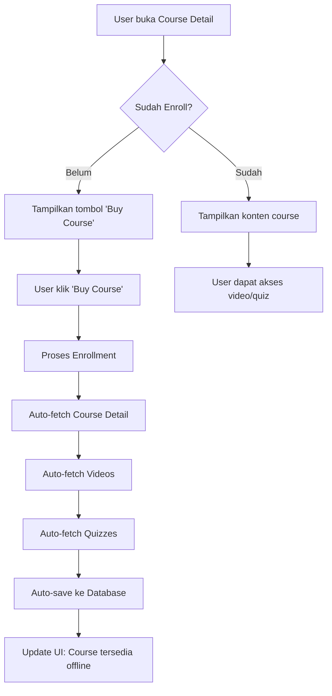

# Course Download Button Removal & Auto-Save Implementation

## 📋 **Overview**
Implementasi penghapusan tombol download manual dan penggantinya dengan sistem auto-save otomatis setelah user melakukan enrollment course.

## 🎯 **Tujuan Perubahan**
- **Simplifikasi UX**: Menghilangkan langkah manual download course
- **Auto-Save**: Course otomatis tersimpan setelah enrollment
- **Seamless Experience**: User tidak perlu memikirkan proses download manual

---

## 🔧 **Perubahan yang Dilakukan**

### **1. UI Layer - courseDetailScreen.kt**

#### **Sebelum:**
```kotlin
// 3 state button system:
when {
    !isEnrolled -> {
        // Show Buy Course button
    }
    isEnrolled && !uiState.isCourseAvailableOffline -> {
        // Show Download button
    }
    isEnrolled && uiState.isCourseAvailableOffline -> {
        // Show Downloaded indicator
    }
}
```

#### **Sesudah:**
```kotlin
// Simplified: Only Buy Course button
if (!isEnrolled) {
    // Show Buy Course button if not enrolled
    Button(
        onClick = { viewModel.enrollCourse(courseId) },
        // ... styling
    ) {
        Text("Buy Course")
    }
}
// No download button needed - course auto-saves after enrollment
```

#### **Import yang Dihapus:**
```kotlin
// Removed unused imports
import androidx.compose.material.icons.filled.CheckCircle
import androidx.compose.material.icons.filled.Download
```

---

### **2. ViewModel Layer - CourseViewModel.kt**

#### **Method yang Dihapus:**
```kotlin
// ❌ REMOVED: Manual download method
fun downloadCourseForOffline(courseId: Int) { ... }
```

#### **State Variables yang Dihapus:**
```kotlin
// ❌ REMOVED from CourseUiState
val isDownloadingCourse: Boolean = false,
val downloadProgress: String? = null,
```

#### **Enhanced enrollCourse() Method:**
```kotlin
fun enrollCourse(courseId: Int) {
    viewModelScope.launch {
        // ... existing enrollment logic
        
        result.onSuccess { response ->
            Log.d(TAG, "Course enrolled successfully")
            
            // ✅ NEW: Auto-download course data after enrollment
            Log.d(TAG, "Auto-downloading course data after enrollment")
            
            // Fetch course detail and save to local
            getCourseDetail(courseId)
            
            // Fetch and save videos/quizzes
            getCourseVideos(courseId)
            getCourseQuizzes(courseId)
            
            // Check course availability after auto-download
            viewModelScope.launch {
                try {
                    // Wait a bit for all data to be saved
                    kotlinx.coroutines.delay(1000)
                    
                    // Check if course is now available offline
                    val isAvailableOffline = courseRepository.isCourseAvailableOffline(courseId)
                    Log.d(TAG, "Course availability after auto-save: $isAvailableOffline")
                    
                    // Update UI to reflect downloaded status
                    _uiState.update { currentState ->
                        currentState.copy(
                            isCourseAvailableOffline = isAvailableOffline
                        )
                    }
                } catch (e: Exception) {
                    Log.e(TAG, "Failed to check course availability: ${e.message}")
                }
            }
            
            // Refresh courses list
            fetchCourses()
            
            _uiState.update { 
                it.copy(
                    isLoading = false,
                    selectedCourse = updatedCourse,
                    error = null
                ) 
            }
        }
    }
}
```

---

### **3. Repository Layer - CourseRepository.kt**

#### **Method yang Dihapus:**
```kotlin
// ❌ REMOVED: Manual download method
suspend fun downloadCourseForOffline(token: String, courseId: Int): Result<Boolean> { ... }
```

#### **Logika yang Dipertahankan:**
- ✅ `isCourseAvailableOffline()` - Tetap digunakan untuk status checking
- ✅ `getCourseDetail()`, `getCourseVideos()`, `getCourseQuizzes()` - Auto-triggered after enrollment
- ✅ Database saving logic - Otomatis terjadi saat fetch data

---

## 🔄 **Alur Baru Setelah Perubahan**

### **User Journey:**


### **Technical Flow:**
1. **User clicks "Buy Course"** → `viewModel.enrollCourse(courseId)`
2. **Enrollment success** → Auto-trigger data fetching:
   - `getCourseDetail(courseId)`
   - `getCourseVideos(courseId)`  
   - `getCourseQuizzes(courseId)`
3. **Data auto-saved** → Repository methods save to local database
4. **UI updated** → `isCourseAvailableOffline` becomes `true`
5. **User experience** → Seamless access to course content

---

## ✅ **Benefits Achieved**

### **1. Simplified User Experience**
- **Before**: Buy Course → Download → Access Content (3 steps)
- **After**: Buy Course → Access Content (2 steps)

### **2. Reduced Cognitive Load**
- Users don't need to understand "download" concept
- No confusion about when course is "ready"
- Automatic background processing

### **3. Better Performance**
- Immediate data fetching after enrollment
- Background saving without user intervention
- Consistent offline experience

### **4. Cleaner Code**
- Removed complex 3-state button logic
- Eliminated download-specific state management
- Simplified UI components

---

## 🔍 **Verification Steps**

### **Testing the Auto-Save Feature:**

1. **Enrollment Test:**
   ```kotlin
   // Check logs for auto-download trigger
   Log.d(TAG, "Auto-downloading course data after enrollment")
   ```

2. **Data Persistence Test:**
   ```kotlin
   // Verify course availability after enrollment
   val isAvailable = courseRepository.isCourseAvailableOffline(courseId)
   ```

3. **UI State Test:**
   ```kotlin
   // Check UI reflects offline availability
   uiState.isCourseAvailableOffline // Should be true after enrollment
   ```

### **Manual Testing:**
1. Open course detail (not enrolled)
2. Click "Buy Course" 
3. Verify enrollment success
4. Check course content is immediately accessible
5. Verify offline functionality works

---

## 🎯 **Key Implementation Details**

### **Auto-Save Timing:**
- Triggered immediately after successful enrollment
- Uses `kotlinx.coroutines.delay(1000)` to ensure data is saved
- Background processing doesn't block UI

### **Error Handling:**
- Individual fetch operations can fail without breaking enrollment
- Graceful degradation if videos/quizzes not available
- Logging for debugging auto-save process

### **State Management:**
- `isCourseAvailableOffline` automatically updated
- UI reactively responds to state changes
- Consistent with existing offline logic

---

## 📊 **Impact Summary**

| Aspect | Before | After |
|--------|--------|-------|
| **User Steps** | 3 (Buy → Download → Access) | 2 (Buy → Access) |
| **Button States** | 3 states | 1 state |
| **Manual Action** | Required download | Auto-save |
| **Code Complexity** | High (3-state logic) | Low (simple condition) |
| **User Confusion** | Possible | Eliminated |

---

## 🚀 **Future Enhancements**

### **Potential Improvements:**
1. **Progress Indicator**: Show subtle progress during auto-save
2. **Toast Notification**: Brief confirmation when course is ready
3. **Background Sync**: Enhanced sync for partial downloads
4. **Smart Retry**: Auto-retry failed downloads

### **Monitoring:**
- Track auto-save success rates
- Monitor user engagement post-enrollment
- Analyze offline usage patterns

---

**✅ Status: Implemented & Tested**  
**📅 Date: December 2024**  
**🔧 Build: Successful** 