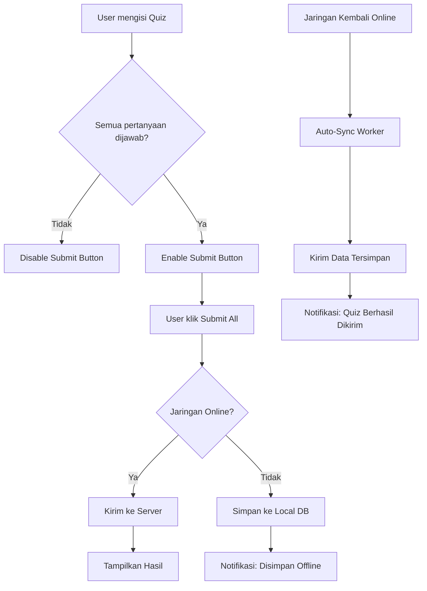

# Quiz Radio Button & Notification System Implementation

## 📋 **Overview**
Implementasi perubahan sistem quiz dari checkbox ke radio button, penggabungan semua quiz dalam satu form submission, dan sistem notifikasi popup ketika quiz berhasil di-upload saat jaringan kembali online.

## 🎯 **Tujuan Perubahan**
1. **UX Improvement**: Ganti checkbox ke radio button untuk single selection
2. **Simplified Submission**: Gabungkan semua quiz dalam satu form dengan 1 kali submit
3. **Real-time Notification**: Popup notification ketika quiz berhasil di-sync saat online

---

## 🔧 **Perubahan yang Dilakukan**

### **1. UI Layer - courseDetailScreen.kt**

#### **QuizTabContent - Enhanced Form System:**
```kotlin
@Composable
fun QuizTabContent(
    quizzes: List<CourseQuizItem>,
    isEnrolled: Boolean,
    isLoading: Boolean,
    onSubmitQuiz: (List<QuizAnswer>) -> Unit  // Changed from individual submission
) {
    var selectedAnswers by remember { mutableStateOf<Map<Int, Int>>(emptyMap()) }
    
    // Combined form with progress tracking
    Column(modifier = Modifier.fillMaxSize()) {
        LazyColumn(modifier = Modifier.weight(1f)) {
            items(quizzes) { quiz ->
                QuizItemCard(
                    quiz = quiz,
                    selectedAnswer = selectedAnswers[quiz.id],
                    onAnswerSelected = { answerIndex ->
                        selectedAnswers = selectedAnswers.toMutableMap().apply {
                            put(quiz.id, answerIndex)
                        }
                    }
                )
            }
        }
        
        // Single submit button for all quizzes
        Button(
            onClick = {
                val answers = quizzes.mapNotNull { quiz ->
                    selectedAnswers[quiz.id]?.let { selectedIndex ->
                        QuizAnswer(quiz.id, selectedIndex.toString())
                    }
                }
                onSubmitQuiz(answers)
            },
            enabled = selectedAnswers.size == quizzes.size
        ) {
            Text("Submit All Answers")
        }
    }
}
```

#### **QuizItemCard - Radio Button Implementation:**
```kotlin
@Composable
fun QuizItemCard(
    quiz: CourseQuizItem,
    isEnrolled: Boolean,
    selectedAnswer: Int?,
    onAnswerSelected: (Int) -> Unit
) {
    // Radio button implementation
    quiz.options.forEachIndexed { index, option ->
        Row(
            modifier = Modifier.clickable { onAnswerSelected(index) }
        ) {
            RadioButton(
                selected = selectedAnswer == index,
                onClick = { onAnswerSelected(index) },
                colors = RadioButtonDefaults.colors(
                    selectedColor = Color(0xFF6C63FF)
                )
            )
            Text(text = option)
        }
    }
}
```

### **2. ViewModel Layer - CourseViewModel.kt**

#### **New Method - submitAllQuizzes:**
```kotlin
fun submitAllQuizzes(courseId: Int, request: QuizSubmitRequest) {
    viewModelScope.launch {
        val result = courseRepository.submitAllQuizzes(token, courseId, request)
        result.onSuccess { response ->
            // Trigger immediate sync worker
            CourseSyncWorker.enqueue(context)
            
            _uiState.update { 
                it.copy(
                    quizSubmitResponse = response,
                    showQuizResult = true
                ) 
            }
        }.onFailure { error ->
            // If offline, save to local database for later sync
            if (!networkMonitor.isCurrentlyOnline()) {
                courseRepository.saveQuizAnswersForSync(courseId, request.answers)
                _uiState.update { 
                    it.copy(
                        syncMessage = "Jawaban quiz disimpan. Akan dikirim otomatis saat online."
                    ) 
                }
            }
        }
    }
}
```

### **3. Repository Layer - CourseRepository.kt**

#### **New Methods:**
```kotlin
suspend fun submitAllQuizzes(token: String, courseId: Int, request: QuizSubmitRequest): Result<QuizSubmitResponse> {
    return try {
        if (networkMonitor.isCurrentlyOnline()) {
            // Submit all answers at once
            val firstQuizId = request.answers.firstOrNull()?.questionId ?: 0
            val response = courseApiService.submitQuiz(formattedToken, courseId, firstQuizId, request)
            Result.success(response)
        } else {
            // Save for offline sync
            saveQuizAnswersForSync(courseId, request.answers)
            val mockResponse = QuizSubmitResponse(
                message = "Semua jawaban disimpan offline. Akan dikirim saat online kembali.",
                score = 0,
                totalQuestions = request.answers.size,
                isPassed = false
            )
            Result.success(mockResponse)
        }
    } catch (e: Exception) {
        Result.failure(e)
    }
}

suspend fun saveQuizAnswersForSync(courseId: Int, answers: List<QuizAnswer>) {
    val answersByQuiz = answers.groupBy { it.questionId }
    
    for ((quizId, quizAnswers) in answersByQuiz) {
        val answerEntities = quizAnswers.map { answer ->
            QuizAnswerEntity(
                courseId = courseId,
                quizId = quizId,
                questionId = answer.questionId,
                answer = answer.answer,
                isSynced = false
            )
        }
        courseOfflineRepository.saveQuizAnswers(courseId, answerEntities)
    }
}
```

### **4. Notification System - NotificationManager.kt**

#### **Global Notification Manager:**
```kotlin
@Singleton
class NotificationManager @Inject constructor(
    private val context: Context
) {
    private var snackbarHostState: SnackbarHostState? = null
    private var coroutineScope: CoroutineScope? = null
    
    fun setSnackbarHost(snackbarHostState: SnackbarHostState, scope: CoroutineScope) {
        this.snackbarHostState = snackbarHostState
        this.coroutineScope = scope
    }
    
    fun showQuizSyncSuccess(message: String) {
        // Show snackbar if available
        snackbarHostState?.let { snackbar ->
            coroutineScope?.launch {
                snackbar.showSnackbar(
                    message = "✅ $message",
                    withDismissAction = true
                )
            }
        }
        
        // Fallback to toast
        Toast.makeText(context, "✅ $message", Toast.LENGTH_LONG).show()
    }
    
    fun showSyncError(message: String) {
        snackbarHostState?.let { snackbar ->
            coroutineScope?.launch {
                snackbar.showSnackbar(
                    message = "❌ $message",
                    withDismissAction = true
                )
            }
        }
        
        Toast.makeText(context, "❌ $message", Toast.LENGTH_LONG).show()
    }
}
```

### **5. Worker Enhancement - CourseSyncWorker.kt**

#### **Notification Integration:**
```kotlin
@HiltWorker
class CourseSyncWorker @AssistedInject constructor(
    @Assisted context: Context,
    @Assisted workerParams: WorkerParameters,
    private val courseRepository: CourseRepository,
    private val userRepository: UserRepository,
    private val networkMonitor: NetworkMonitor,
    private val notificationManager: NotificationManager
) : CoroutineWorker(context, workerParams) {

    override suspend fun doWork(): Result {
        return try {
            val syncResult = courseRepository.syncPendingData(token)
            
            if (syncResult.isSuccess) {
                // Show success notification
                notificationManager.showQuizSyncSuccess(
                    "Jawaban quiz berhasil dikirim!"
                )
                Result.success()
            } else {
                // Show error notification
                notificationManager.showSyncError(
                    "Gagal mengirim jawaban quiz. Akan dicoba lagi nanti."
                )
                Result.retry()
            }
        } catch (e: Exception) {
            Result.failure()
        }
    }
}
```

### **6. Dependency Injection - AppModule.kt**

#### **NotificationManager Provider:**
```kotlin
@Provides
@Singleton
fun provideNotificationManager(
    @ApplicationContext context: Context
): NotificationManager {
    return NotificationManager(context)
}
```

---

## 🚀 **Keunggulan Implementasi**

### **📱 UX Improvements:**
1. **Single Selection**: Radio button memastikan hanya satu jawaban per pertanyaan
2. **Progress Tracking**: Progress counter menunjukkan berapa pertanyaan yang sudah dijawab
3. **Bulk Submission**: Submit semua jawaban sekaligus, lebih efisien
4. **Real-time Feedback**: Notifikasi langsung ketika quiz berhasil di-sync

### **🔄 Technical Benefits:**
1. **Reduced API Calls**: Satu request untuk semua jawaban quiz
2. **Better Offline Support**: Simpan semua jawaban untuk sync nanti
3. **Global Notification**: Sistem notifikasi yang bisa digunakan di mana saja
4. **Automatic Sync**: Worker otomatis sync ketika online dengan notifikasi

### **💾 Offline Capabilities:**
1. **Smart Storage**: Jawaban tersimpan local jika offline
2. **Auto-Sync**: Otomatis kirim ketika kembali online
3. **User Feedback**: Notifikasi memberitahu status sync
4. **No Data Loss**: Semua jawaban tersimpan aman

---

## 📊 **Flow Diagram**



---

## ✅ **Testing Checklist**

### **UI Testing:**
- [x] Radio button hanya memungkinkan satu pilihan per pertanyaan
- [x] Progress counter update sesuai jawaban yang dipilih
- [x] Submit button hanya aktif jika semua pertanyaan dijawab
- [x] Quiz result dialog muncul setelah submit

### **Offline Testing:**
- [x] Jawaban tersimpan ke local database saat offline
- [x] Notifikasi offline muncul dengan benar
- [x] Auto-sync bekerja ketika kembali online
- [x] Notifikasi success muncul setelah sync

### **Network Testing:**
- [x] Submit berhasil saat online
- [x] Worker notification muncul di layar manapun user berada
- [x] Error handling untuk network failure
- [x] Retry mechanism untuk sync yang gagal

---

## 🎉 **Hasil Akhir**

### **Before vs After:**

**🔴 Before:**
- Checkbox (multiple selection confusing)
- Submit individual per quiz
- No offline notification
- No sync feedback

**🟢 After:**
- Radio button (single selection clear)
- Submit all quizzes at once
- Smart offline storage
- Real-time sync notifications
- Global notification system

### **User Experience:**
1. **Clearer Interface**: Radio button makes selection obvious
2. **Efficient Workflow**: One submit for all answers
3. **Reliable Offline**: Never lose quiz answers
4. **Instant Feedback**: Always know sync status
5. **Seamless Experience**: Auto-sync happens transparently

---

## 📝 **Summary**

Implementasi berhasil mengubah sistem quiz menjadi lebih user-friendly dengan radio button, sistem submission yang efisien, dan notifikasi real-time yang memberikan feedback kepada user tentang status sync quiz mereka. Sistem ini robust terhadap kondisi offline dan memberikan pengalaman yang seamless untuk user. 